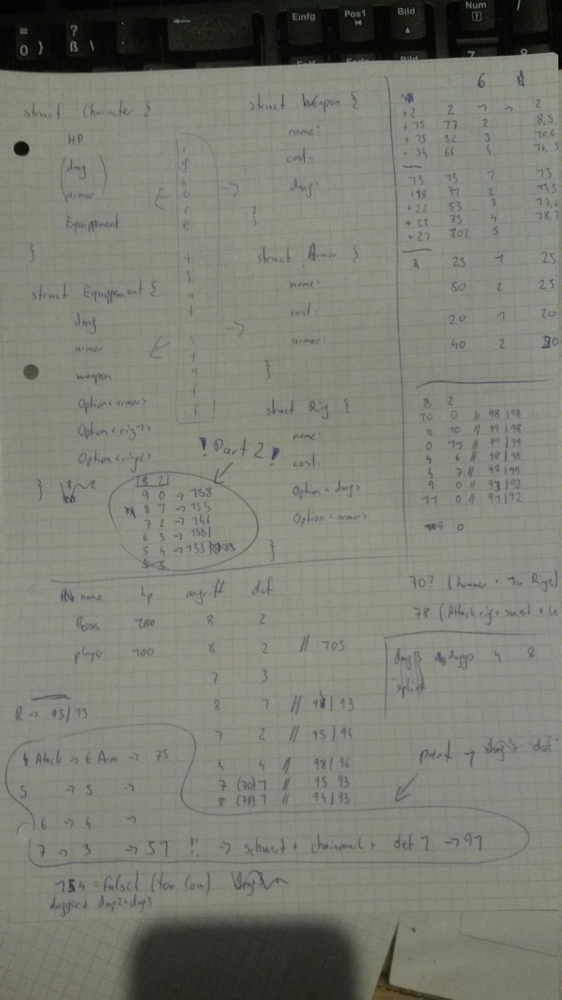

## Day 21 (RPG Simulator) - initially solved with brain, pen, and paper

### Preface

So, I started this task using Rust.
The brainstorming for the required enums/structs can also be seen on the paper.
During writing these structs and implementing basic functions (printing,
(un)equipping stuff, etc.) I tried to come up with a viable algorithm.
However, after implementing the basics, I somehow lost motivation to program.
So, I made a break, played some video games and did other stuff.
After some time, I still wasn't in the mood to program, however I wanted to
solve the puzzle.
That's why I took out pen & paper and tried to use my brain.

### Part 1
Actually it's really simple:
The outcome of the fight depends on only four values:
- The damage-value of the boss: `dmgB`
- The armor-value of the boss: `defB`
- The damage-value of the player: `dmgP`
- The armor-value of the player: `defP`

Calculation of the damage one character takes is simple:
Amount of HP the player loses each turn:
```
dmgB - defP
```
Amount of HP the boss loses each turn:
```
dmgP - defB
```

In order to win, we need to have more HP than the boss (at the end of the game).
Additionally, since we always attack first, it would be possible to just end up
with the same amount of remaining HP after each round.
```
dmgP - defB >= dmgB - defP      | + defB

dmgP >= dmgB - defP + defB      | + defP

dmgP + defP >= dmgB + defB
```

This means, that in order to win, we need more accumulative points than the
boss. It is completely irrelevant whether this is only on Damage or only on
Armor.
Assuming that `the less points, the cheaper` we need to find the cheapast values
for `dmgP + defP` which are equal to the amount of the boss' points.

My personal boss has `8 damage` and `2 Armor`.
Therefore, I was looking for the **cheapest combination to buy `10 points`**
(Based on the assumption that it will be cheaper to get 10 points
than it is to get 11, 12, or even more.)

The following table displays all available items, their costs and boni, as well
as an indicator for cost per point.

```
Name      	Cost	  Damage	     Defense
------------------------------------------------
Dagger          8       4 (2.00000)     0 (inf)
Shortsword      10      5 (2.00000)     0 (inf)
Warhammer       25      6 (4.16667)     0 (inf)
Longsword       40      7 (5.71429)     0 (inf)
Greataxe        74      8 (9.25000)     0 (inf)
Leather         13      0 (inf)         1 (13.00000)
Chainmail       31      0 (inf)         2 (15.50000)
Splintmail      53      0 (inf)         3 (17.66667)
Bandedmail      75      0 (inf)         4 (18.75000)
Platemail       102     0 (inf)         5 (20.40000)
Damage +1       25      1 (25.00000)    0 (inf)
Damage +2       50      2 (25.00000)    0 (inf)
Damage +3       100     3 (33.33333)    0 (inf)
Defense +1      20      0 (inf)         1 (20.00000)
Defense +2      40      0 (inf)         2 (20.00000)
Defense +3      80      0 (inf)         3 (26.66667)

```

The rest was just using a calculator and iterating over some possibilities.
Once I got time, I'll also implement this approach in Rust and other languages.

### Part 2
Part 2 requires us to **lose as expensive as possible**.
We know that we win, when we have at least 10 points, therefore we'll simply
look for the **most expensive combination to buy 9 points**. (Again, based on
the assumption that it is more expensive to buy 9 points than it is to buy less)

### Notes (paper)

