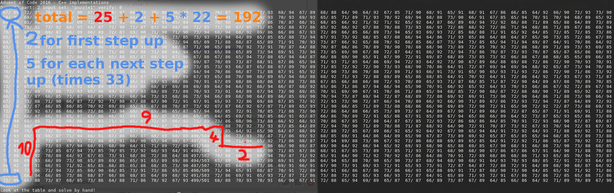

# Explanation

First, I used the following code to print the grid:
```c++
for(unsigned ii = 0; ii < gridsize_x; ++ii){
    for(unsigned jj = 0; jj < gridsize_y; ++jj){
        Node &node = grid[ii][jj];
        if( node.used == 0 ){
            printf("___");
        } else {
            printf("%3d", node.used);
        }

        printf("/%3d ", node.size);
    }
    printf("\n");
}
```
\* See [2016/c++/day22/part2.cpp](../../c++/day22/part2.cpp)

So, there's exactly one empty node and it seems like no node is full enough
to get the contents of any other node.
This means, we have to "move" the empty space towards our data (red path) and
then use it to move our data up (blue path).


